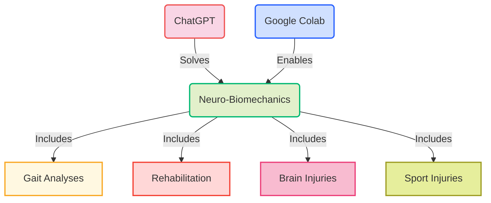

# ChatGPTBiomechanics
Let's do ChatGPT OpenAI and Biomechanics

```mermaid
graph TD;
  A(ChatGPT) -- "Solves" --> B(Neuro-Biomechanics);
  C(Google Colab) -- "Enables" --> B;
  B -- "Includes" --> D[Gait Analyses];
  B -- "Includes" --> E[Rehabilitation];
  B -- "Includes" --> F[Brain Injuries];
  B -- "Includes" --> G[Sport Injuries];
  style A fill:#F9D5E5, stroke:#F05555, stroke-width:2px;
  style B fill:#E2F0CB, stroke:#00B872, stroke-width:2px;
  style C fill:#D0E0FF, stroke:#2962FF, stroke-width:2px;
  style D fill:#FFF8E1, stroke:#F9A825, stroke-width:2px;
  style E fill:#FFD7D7, stroke:#F44336, stroke-width:2px;
  style F fill:#F8BBD0, stroke:#EC407A, stroke-width:2px;
  style G fill:#E6EE9C, stroke:#9E9D24, stroke-width:2px;
```
