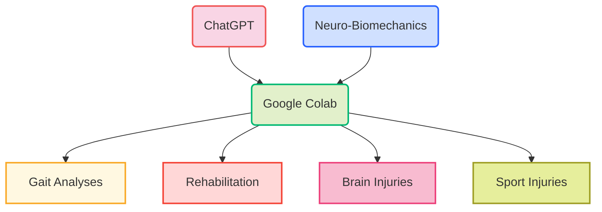

# ChatGPTBiomechanics

Let's embark on an exciting journey with ChatGPT OpenAI and Biomechanics!

Here's my roadmap that lays out the foundational applications of biomechanics, with only a few examples. But, these applications are merely the tip of the iceberg, as the potential of biomechanics extends to all types of human and animal studies. I'll be constantly updating this roadmap as I make progress, and it's free for all to access, use, and share.

Please don't hesitate to share your thoughts or suggest any ideas for improvement. Together, we can unleash the full potential of biomechanics and pave the way for groundbreaking advancements in this field!

